# ⚡ Computer Hardware & Architecture Performance Advisor

[](https://www.oracle.com/java/)
[](https://github.com)
[](https://github.com)
[](https://github.com)
[](LICENSE)

An intelligent full-stack hardware recommendation, system architecture planning, and real-time performance analytics platform. Built with a high-throughput, zero-dependency Java SE HTTP backend and a sleek, futuristic cyber-styled web interface.

Developed by **Vijay Bhaskar Reddy**.

---

## 📑 Table of Contents

- [Overview](#-overview)
- [Key Features](#-key-features)
- [System Architecture](#-system-architecture)
- [Tech Stack](#-tech-stack)
- [Hardware Catalog & Profiling](#-hardware-catalog--profiling)
- [REST API Reference](#-rest-api-reference)
- [Getting Started](#-getting-started)
  - [Prerequisites](#prerequisites)
  - [Quick Start (Windows)](#quick-start-windows)
  - [Manual Compilation & Run (Linux / macOS / Windows)](#manual-compilation--run-linux--macos--windows)
- [Project Directory Structure](#-project-directory-structure)
- [Dual-Mode Operation](#-dual-mode-operation)
- [Screenshots & UI Showcase](#-screenshots--ui-showcase)
- [Contributing](#-contributing)
- [License](#-license)

---

## 🌟 Overview

Choosing the optimal hardware components for a custom PC or enterprise server configuration requires balancing budget, thermal design power (TDP), bus interfaces, bottlenecks, and workload-specific requirements. 

**Computer Hardware & Architecture Performance Advisor** eliminates the guesswork by providing:
1. **Rule-based recommendation algorithms** tuned for specialized domains (Gaming, Content Creation, CAD/Engineering, Edge AI, Virtualization, and Datacenters).
2. **Dynamic bottleneck detection** calculating CPU-vs-GPU balance ratios with natural language diagnostics.
3. **Automated power & thermal headroom calculations** (TDP analytics, recommended PSU capacities with 35% safety margins).
4. **Multidimensional workload performance indices** spanning 1080p/1440p/4K gaming, 3D rendering, productivity compilation, and AI compute.

---

## ✨ Key Features

| Feature | Description |
| :--- | :--- |
| 🧩 **Interactive Build Configurator** | Select and mix-and-match CPUs, GPUs, RAM, Motherboards, Storage, PSUs, and Coolers with real-time feedback. |
| 🎯 **Workload-Driven Recommender** | Tailors complete 7-part hardware builds matching target budget, environment, and tier presets. |
| ⚖️ **Real-Time Bottleneck Engine** | Calculates system bottleneck percentages and provides actionable hardware upgrade advisories. |
| ⚡ **TDP & Power Supply Sizing** | Computes component power draw, applies base platform overheads, and recommends ideal PSU wattage. |
| 📈 **Workload Performance Gauges** | Generates dynamic scores (0–100) for Gaming (1080p, 1440p, 4K), 3D VFX Rendering, Software Engineering, and AI/ML Workloads. |
| 🛡️ **Hardware Compatibility & Health Guard** | Flags thermal throttling risks (e.g., high-TDP CPUs on stock coolers), power shortfalls, and memory bus optimizations (XMP/EXPO). |
| 🎨 **Futuristic Cyber UI** | Features animated 3D particle matrix canvas, floating pill navigation, dynamic telemetry gauges, and custom themes. |
| 🚀 **Zero-Dependency Native Backend** | Built using pure Java standard library (`com.sun.net.httpserver`) with custom JSON parsers—no heavy external frameworks required. |

---

## 📐 System Architecture

```mermaid
graph TD
    UI["Web Client (HTML5 / CSS3 / ES6+)"] -->|HTTP / JSON Requests| Server["Java Embedded HttpServer (Port 8080)"]
    
    subgraph Java Backend Core
        Server --> Router{"REST API Router"}
        Router -->|/api/hardware| H_Handler["HardwareApiHandler"]
        Router -->|/api/recommend| R_Handler["RecommendApiHandler"]
        Router -->|/api/analyze| A_Handler["AnalyzeApiHandler"]
        Router -->|/api/stats| S_Handler["StatsApiHandler"]
        Router -->|Static Assets| Static_Handler["StaticFileHandler"]
        
        H_Handler --> H_Service["HardwareService (In-Memory Catalog)"]
        R_Handler --> R_Engine["RecommendationEngine"]
        A_Handler --> P_Analyzer["PerformanceAnalyzer"]
        S_Handler --> H_Service
        
        R_Engine --> H_Service
        P_Analyzer --> H_Service
        
        H_Handler & R_Handler & A_Handler & S_Handler --> Json["JsonUtil (Custom Serializer)"]
    end
```



---

## 🛠️ Tech Stack

### Backend
- **Language**: Java (SE 8 or higher; tested on OpenJDK / Oracle JDK 17, 21)
- **HTTP Server**: `com.sun.net.httpserver.HttpServer` (Native Java HTTP daemon with thread pooling)
- **Concurrency**: Fixed Thread Pool Executor (`Executors.newFixedThreadPool(8)`)
- **Serialization**: Zero-dependency custom JSON utility (`JsonUtil`)
- **Architecture**: Domain-Driven Layered Architecture (Handlers, Services, Models, Utilities)

### Frontend
- **Markup & Layout**: Semantic HTML5, CSS3 Grid & Flexbox
- **Design System**: Custom CSS variables, futuristic cyber themes, glassmorphism, responsive pill navigation
- **Scripting**: Vanilla JavaScript (ES6+ modular architecture)
- **Visual Effects**: Custom 2D/3D Canvas Particle Matrix, live metric progress bars, dynamic score gauges

---

## 📊 Hardware Catalog & Profiling

The system features an extensive in-memory catalog across 7 critical hardware categories and multiple operational environments:

- **Component Types**: `CPU`, `GPU`, `RAM`, `Motherboard`, `Storage`, `PSU`, `Cooler`
- **Tiers**: `Entry`, `Budget`, `Mid`, `High`, `Enthusiast`
- **Workload Profiles**:
  - `Basic / Student`: Cost-effective, energy-efficient daily driving
  - `Office / Productivity`: Multitasking, POS, and CAD drafting
  - `Media / NAS / HTPC`: Low-power, high-storage, hardware transcode support
  - `Home / Gaming Den`: High-IPC gaming champions with 3D V-Cache
  - `Studio / VFX / 3D`: High core-count multithreaded render engines
  - `Esports`: Ultra-low frame latency and competitive FPS
  - `Edge AI & NPU`: High TOPS neural processing units
  - `Datacenter & Cloud`: AMD EPYC & Threadripper PRO workstations

---

## 🔌 REST API Reference

The backend exposes CORS-enabled JSON REST endpoints:

### 1. Hardware Catalog Search & Filter
```http
GET /api/hardware?type={type}&tier={tier}&env={env}&q={query}
```
**Query Parameters:**
- `type` *(optional)*: `cpu`, `gpu`, `ram`, `mb`, `storage`, `psu`, `cooler`
- `tier` *(optional)*: `basic`, `budget`, `mid`, `high`, `enthusiast`
- `env` *(optional)*: `basic`, `entry_office`, `media`, `home`, `office`, `studio`, `esports`, `edge`, `cloud`, `datacenter`
- `q` *(optional)*: Free-text search string (matches model, brand, or specs)

<details>
<summary><b>Example Response (200 OK)</b></summary>

```json
[
  {
    "type": "cpu",
    "tier": "mid high",
    "environment": "home",
    "brand": "AMD",
    "model": "Ryzen 7 7800X3D",
    "specs": "8 Cores / 16 Threads, 5.0GHz Boost, 96MB 3D V-Cache",
    "metric": "120W TDP",
    "metricLabel": "Power Draw",
    "tag": "Gaming Champion",
    "price": 35990.0,
    "tdpWatts": 120,
    "perfScore": 96
  }
]
```
</details>

---

### 2. Intelligent Build Recommendation
```http
POST /api/recommend
Content-Type: application/json
```
**Request Body:**
```json
{
  "environment": "home",
  "tier": "high",
  "preference": "performance",
  "max_budget": 150000
}
```
**Response**: Returns an array of 7 recommended `HardwareComponent` objects satisfying the workload profile.

---

### 3. System Analysis & Bottleneck Evaluation
```http
POST /api/analyze
Content-Type: application/json
```
**Request Body:**
```json
{
  "cpu": "Ryzen 7 7800X3D",
  "gpu": "GeForce RTX 4080 Super",
  "ram": "32GB DDR5-6000MHz",
  "mb": "B650 Gaming WiFi",
  "storage": "2TB NVMe PCIe 4.0 M.2",
  "psu": "850W Gold Fully Modular",
  "cooler": "360mm AIO Liquid Cooler",
  "workload": "gaming"
}
```

<details>
<summary><b>Example Response (200 OK)</b></summary>

```json
{
  "totalPrice": 164930.0,
  "totalTdpWatts": 515,
  "recommendedPsuWatts": 700,
  "bottleneckPercentage": 4.2,
  "bottleneckComponent": "Balanced System",
  "bottleneckExplanation": "CPU and GPU are exceptionally well matched. No noticeable bottleneck under standard workloads.",
  "gaming1080pScore": 98,
  "gaming1440pScore": 97,
  "gaming4kScore": 94,
  "renderingScore": 88,
  "productivityScore": 91,
  "aiComputeScore": 93,
  "compatibilityAlerts": [
    "All hardware components verified 100% compatible. Power, bus interfaces, and thermal tolerances clear."
  ],
  "optimizationTips": [
    "Enable XMP/EXPO in BIOS to achieve rated memory frequency.",
    "Install OS and high-throughput databases on PCIe 4.0 M.2 slot #1 directly wired to CPU.",
    "Ensure chassis has at least 2 intake and 1 exhaust fan for optimal GPU airflow."
  ]
}
```
</details>

---

### 4. System Status & Telemetry
```http
GET /api/stats
```
**Response (200 OK):**
```json
{
  "status": "ONLINE",
  "engine": "Java 8+ Architecture & Hardware Advisor Engine",
  "version": "2.0.0",
  "total_hardware_components": 78,
  "categories": ["CPU", "GPU", "RAM", "Motherboard", "Storage", "PSU", "Cooler"],
  "environments": ["basic", "entry_office", "media", "home", "office", "studio", "esports", "edge", "cloud", "research", "datacenter"]
}
```

---

## 🚀 Getting Started

### Prerequisites
- **Java Development Kit (JDK)**: Version 8 or higher (JDK 17 or 21 LTS recommended).
  Verify your installation:
  ```bash
  javac -version
  java -version
  ```

---

### Quick Start (Windows)
Double-click [`run.bat`](file:///p:/scratch/architecture-advisor/run.bat) or execute from PowerShell / Command Prompt:
```cmd
.\run.bat
```
This script will:
1. Compile all Java source files under `src/` into `bin/`.
2. Start the HTTP server on port `8080`.
3. Automatically launch your default browser at `http://localhost:8080`.

To run on a custom port:
```cmd
.\run.bat 9090
```

---

### Manual Compilation & Run (Linux / macOS / Windows)

1. **Clone the repository:**
   ```bash
   git clone https://github.com/your-username/architecture-advisor.git
   cd architecture-advisor
   ```

2. **Compile Java sources:**
   ```bash
   mkdir bin
   javac -d bin -sourcepath src src/com/advisor/Main.java
   ```

3. **Launch the server:**
   ```bash
   java -cp bin com.advisor.Main 8080
   ```

4. **Access the application:**
   Open [http://localhost:8080](http://localhost:8080) in your web browser.

---

## 📁 Project Directory Structure

```plaintext
architecture-advisor/
├── .gitignore                     # Git ignore rules
├── index.html                     # Main cyber-styled web application interface
├── styles.css                     # Design system, cyber theme tokens & animations
├── script.js                      # Client logic, particle matrix & live analytics
├── run.bat                        # Windows one-click build & launch automation
├── vercel.json                    # Static deployment configuration
├── README.md                      # Project documentation
│
├── assets/                        # Static media, icons & background visuals
│
└── src/                           # Java Full-Stack Backend Source Code
    └── com/
        └── advisor/
            ├── Main.java          # Application entry point & HttpServer configuration
            │
            ├── handler/           # HTTP Request Handlers (REST & Static)
            │   ├── AnalyzeApiHandler.java      # /api/analyze endpoint handler
            │   ├── HardwareApiHandler.java     # /api/hardware endpoint handler
            │   ├── RecommendApiHandler.java    # /api/recommend endpoint handler
            │   ├── StaticFileHandler.java      # Static web asset server (HTML/CSS/JS)
            │   └── StatsApiHandler.java        # /api/stats telemetry endpoint handler
            │
            ├── model/             # Data Transfer Objects & Domain Models
            │   ├── AnalysisRequest.java        # Build analysis request payload model
            │   ├── BuildReport.java            # Comprehensive build analytics report
            │   ├── HardwareComponent.java      # Hardware component entity model
            │   └── RecommendationRequest.java  # Recommendation criteria request model
            │
            ├── service/           # Business Logic & Analytical Engines
            │   ├── HardwareService.java        # Hardware catalog management & querying
            │   ├── PerformanceAnalyzer.java    # Bottleneck & benchmark scoring logic
            │   └── RecommendationEngine.java   # Rule-based component selector
            │
            └── util/              # Utilities
                └── JsonUtil.java               # Pure Java JSON serializer & parser
```

---

## 🌐 Dual-Mode Operation

To ensure maximum versatility across environments, **Computer Hardware & Architecture Performance Advisor** operates in two modes:

1. **Full-Stack REST Mode (Recommended)**:
   - Powered by the native Java backend.
   - All recommendation algorithms, bottleneck calculations, and search filters execute server-side.
   - Status badge in the navigation bar displays: `● Java Active`.

2. **Client-Side Fallback Mode**:
   - If deployed on static hosting platforms (such as Vercel, GitHub Pages, or Netlify) without the Java runtime, the client frontend automatically falls back to an embedded browser calculation engine.
   - Ensures 100% interactive uptime regardless of hosting environment.

---

## 👨‍💻 Author

**Vijay Bhaskar Reddy**  
- System Architect & Full-Stack Developer
- GitHub: [@192425155KVijayBhsakarReddy](https://github.com/192425155KVijayBhsakarReddy)

---

## 📄 License

This project is licensed under the [MIT License](LICENSE) — free for academic, personal, and commercial exploration.